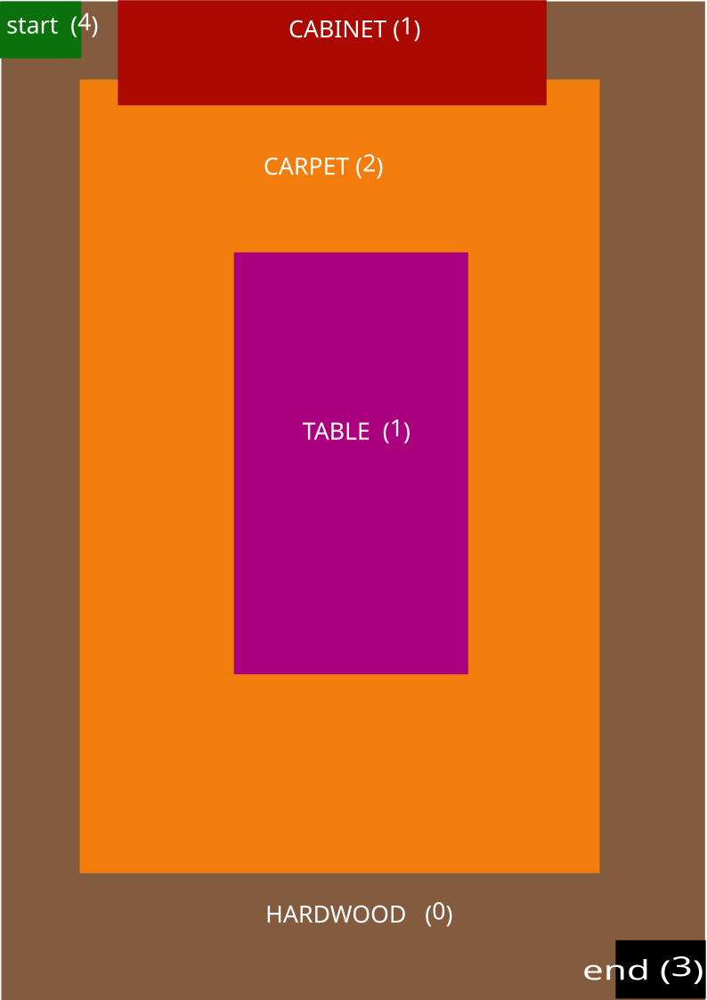

# Assignment 1

- **Environment Representation:**
    - **Grid-Based Map:** Employ a 2D grid where each cell represents a small area of the floor.
    - **Cell States:**
        - `0`: Free space (cleanable, hardwood)
        - `1`: Obstacle (furniture, wall)
        - `2`: Carpet (cleanable, higher movement cost)
        - `3`: Target location (cleaning starting point)
        - `4`:Start location
        
        
        
    - **Cost:**
        - `0`: cost = 1
        - `2`: cost = 4
    
    - **Map Creation:**
        - we will use pythons map element to simulate the environment
        - 

        `Environment = [
        ["0", "0", "0", "1", "1", "1", "1", "0", "0", "0"],
        ["0", "0", "0", "1", "1", "1", "1", "0", "0", "0"],
        ["0", "0", "2", "2", "2", "2", "2", "2", "0", "0"],
        ["0", "0", "2", "2", "2", "2", "2", "2", "0", "0"],
        ["0", "0", "2", "2", "1", "1", "2", "2", "0", "0"],
        ["0", "0", "2", "2", "1", "1", "2", "2", "0", "0"],
        ["0", "0", "2", "2", "1", "1", "2", "2", "0", "0"],
        ["0", "0", "2", "2", "1", "1", "2", "2", "0", "0"],
        ["0", "0", "2", "2", "1", "1", "2", "2", "0", "0"],
        ["0", "0", "2", "2", "1", "1", "2", "2", "0", "0"],
        ["0", "0", "2", "2", "2", "2", "2", "2", "0", "0"],
        ["0", "0", "2", "2", "2", "2", "2", "2", "0", "0"],
        ["0", "0", "0", "0", "0", "0", "0", "0", "0", "0"],
        ["0", "0", "0", "0", "0", "0", "0", "0", "0", "0"]
        ]`

        - 
        

- **States and Actions:**
    - **State:** The robot's current grid cell coordinates (x, y).
    - **Actions:**
        - `MoveUp`: Valid if the next cell is free (`state + (0, 1)`) - Only considered if the current direction is "up".
        - `MoveDown`: Valid if the next cell is free (`state - (0, 1)`) - Only considered if the current direction is "down".
        - `MoveLeft`: Valid if the next cell is free (`state - (1, 0)`) - Only considered if the current direction is "left".
        - `MoveRight`: Valid if the next cell is free (`state + (1, 0)`) - Only considered if the current direction is "right".

- **Cost Function (g(x))**:
    - **Basic Cost:** Unit cost for each action (movement or turn).
    - **Terrain-Aware Cost:** Assign higher costs to energy-intensive actions, e.g., moving on carpet vs. hardwood.
    - `0`: cost = 1 (free space /hardwood)
    - `2`: cost = 2 (free space /carpet)

- **Heuristic Function (h(x))**:
    - **Manhattan Distance:** Simple estimate of remaining distance, ignoring obstacles.
    - **Obstacle-Aware Heuristic:**
        - Precompute a distance map where each cell stores the shortest distance to the target while considering obstacles (using Dijkstra's algorithm).
        - Use the precomputed distance from the robot's current cell to the target as the heuristic value.
        - This penalizes paths with extensive obstacle detours.
- Constraints
    1. Obstacles [`1`] must be Avoided (you cannot go to it or through it)
    2. the Free terrain [`0`] & [`2`] should ways be cleaned first before reaching the goal.
    3. choose a path that is more energy efficient to turns ,the fewer turns the bet
    4. cannot clean where its been cleaned before thus to avoid repetition.

### Things To Be Done

- ***A Search Algorithm Implementation with manhattan distance heuristics ( Python ):***
- ***A Search Algorithm Implementation with Dijkstra’s  heuristics ( Python ):***
- **Qt5 Visualization (using PyQt5):**